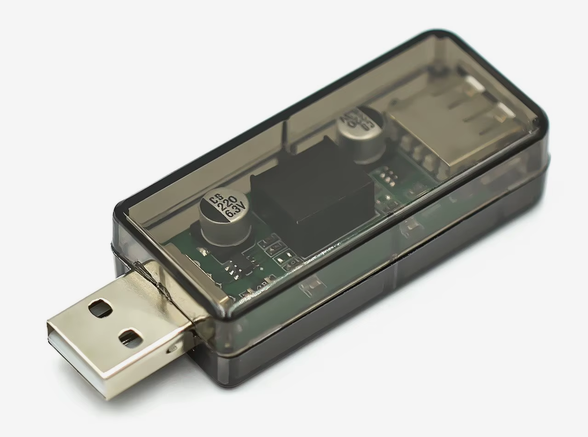
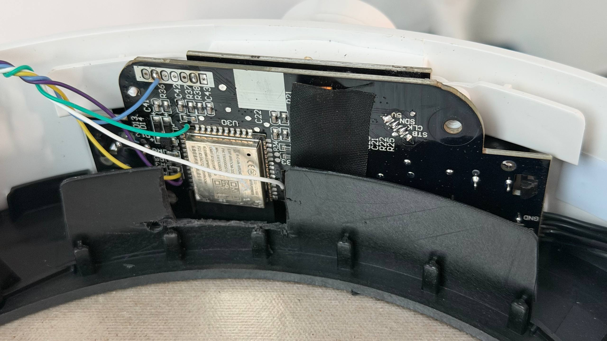
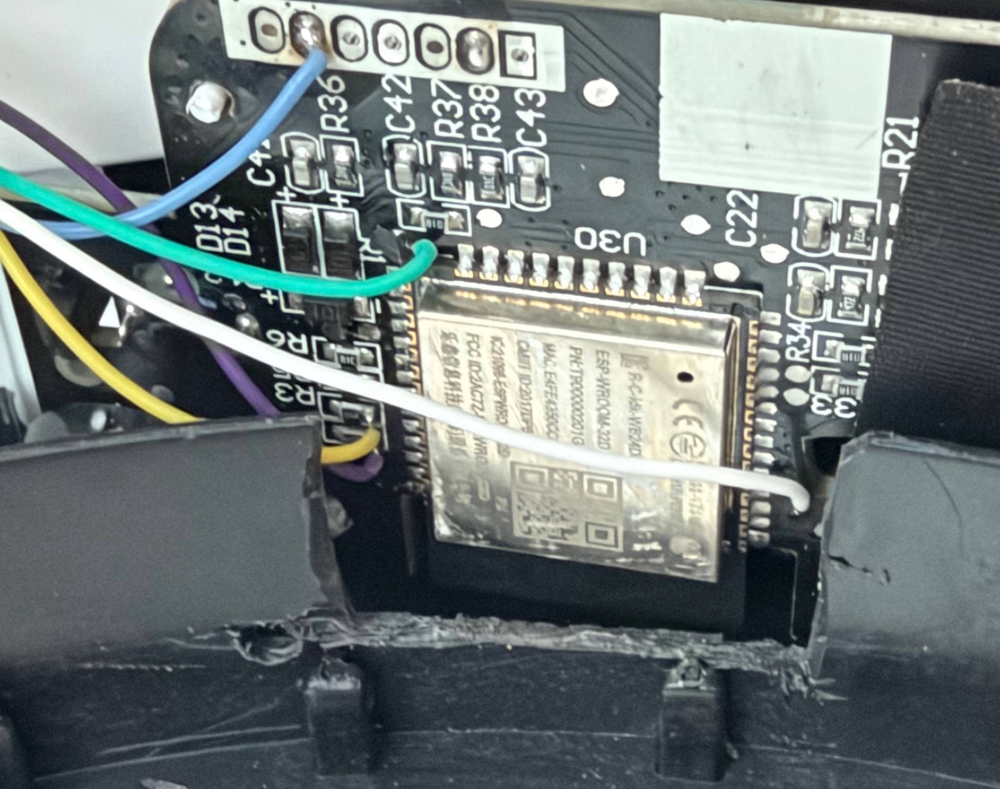

<div align="center">


# Xiaomi Mijia MCL02M Custom Firmware

**English · Русский · 简体中文 · local-first · physical-control-first**

</div>

This repository contains replacement interface firmware for the **Xiaomi Mijia
Induction Cooker 2, model MCL02M** (`chunmi.ihcooker.v2`). The original appliance
was sold with a Chinese-only local interface. Its detachable control board uses
an ordinary **Espressif ESP-WROOM-32D** module, which made it possible to study
the panel, document the power-board protocol, and build a new local interface.

The custom firmware adds English, Russian, and Simplified Chinese UI, while
keeping all heating commands behind the physical controls on the cooker.

> # **NO MI HOME, MIOT, XIAOMI CLOUD, NFC OR STOCK RECIPES**
>
> **Those original functions are intentionally not supported.** The project uses
> its own local UI, local Wi-Fi provisioning, local web settings, profiles, and
> safety state machine. The web interface cannot start or stop heating.

## What the custom firmware adds

- direct **POWER** control from `0…99`;
- stock-compatible **small-cookware limiting**: restricted power-board feedback
  caps the real output at gear 35 in every mode, reports the permitted POWER value,
  and explains blocked upward adjustments on the OLED;
- **temperature control with a PI/PID-style regulator**, high-power preheat,
  conservative approach, and a hold stage capped at gear 35;
- live NTC temperature, IGBT temperature, mains voltage, selected/applied power,
  countdown, and state information on the 64×48 OLED;
- cooking timer with seconds, manual 24-hour clock, SNTP time synchronization,
  **START IN** and **START AT** delayed start;
- five persistent presets, each containing up to five timed POWER or TEMPERATURE
  stages executed in sequence;
- English, Russian, and Simplified Chinese panel UI;
- local Wi-Fi onboarding and a self-contained web page for settings and preset
  editing; credentials are entered by the owner and stored in the custom NVS
  namespace, never compiled into the firmware;
- custom OLED artwork, power/status LEDs, and six PWM melodies;
- NoPan recovery, latched errors, thermal guards, hard run limit, safe boot Stop,
  and a single 500 ms power-control heartbeat.
- dismissible warnings with the exact raw value for previously unseen nonzero
  power-board `R20` statuses; known fault groups retain their normal E-codes.

The complete three-language operating guide is available as a single offline
file: **[User manual](docs/user-manual.html)**.

> # **BACK UP THE COMPLETE 16 MiB FLASH BEFORE YOU WRITE ANYTHING**
>
> **Do not flash this project until you have read the ESP32's entire flash from
> `0x000000` through `0xFFFFFF`, saved it in at least two safe locations, and
> verified the backup by reading it twice and comparing SHA-256 hashes.**
>
> The original image contains the stock firmware as well as device-specific
> partitions and settings. Without a verified full-flash backup, restoring this
> particular cooker to its original factory state may be impossible. A copy of
> somebody else's dump is not an equivalent recovery image and must not be
> published with this repository. See [Flashing and recovery](docs/FLASHING.md)
> before connecting the programmer.

## Hardware and programming connection

The interface board exposes ROM-bootloader test points:

| Test point | Purpose |
|---|---|
| `GND` | logic ground |
| `3V3` | 3.3 V logic rail/reference — **never apply 5 V here** |
| `EN` | ESP32 reset/enable |
| `GPIO0` | hold low across reset to enter the ROM bootloader |
| `RXD0` | ESP32 UART receive; connect to USB-UART TX |
| `TXD0` | ESP32 UART transmit; connect to USB-UART RX |

The firmware was programmed with a **3.3 V logic USB-UART adapter**. To enter
download mode, pull `GPIO0` low, pulse `EN` low/high, then release `GPIO0`.
The board used during development was powered separately with **5 V through its
original low-voltage panel connector**, not through the `3V3` test point.

> # **MAINS-ISOLATION REQUIREMENT — READ BEFORE CONNECTING USB**
>
> **Program the ESP32 only when the interface board is physically disconnected
> from the cooker power board and powered from a separate safe supply, or use a
> proven galvanically isolated USB path.**
>
> Many available USB isolator modules combine an isolated DC/DC converter with
> an **ADuM3160-class USB data isolator**. Confirm that the module really isolates
> both data and power, has adequate insulation and voltage rating, and is used
> within its specified USB speed/current limits. A normal USB-UART adapter, a
> laptop charger, or an oscilloscope ground is **not** galvanic isolation.

<p align="center">
  
</p>

<p align="center"><em>An ADuM3160-based USB galvanic isolator of the type
discussed above. Always verify the specifications and actual isolation of the
particular module before use.</em></p>

The induction cooker contains rectified mains and high-current switching nodes.
Do not work on it energized unless you are qualified and have an isolation plan.
Never connect an earth-referenced scope or non-isolated USB ground to an unknown
internal ground. Allow the power-board-controlled fan to finish cooling before
removing power.

### Accessing the programming points

> **Removing the interface board is not recommended.** The rotary encoder makes
> board removal extremely difficult. On the unit documented here, the author
> instead used a regular utility knife to cut away a small section of the plastic
> housing, working carefully and gradually, step by step. This exposed the
> programming area without removing the board. Disconnect the appliance from
> mains power before doing any mechanical work, and take care not to damage the
> PCB, wiring, or nearby components.



*Overall view of the interface board after creating access to the programming
area.*



*Close-up of the soldered programming connections. Follow the test-point table
above rather than relying on wire colors.*

A link to the full project article will be added later.

## Repository map

```text
assets/
  images/                 source art, 64×48 OLED frames, manual illustration
  sounds/                 final six-melody pack and design experiments
docs/
  AI_DEVELOPMENT_CONTEXT.md
  STATE_MACHINE_IMPLEMENTATION_PLAN.md
  POWER_BOARD_PROTOCOL.md
  FLASHING.md
  user-manual.html        self-contained EN/RU/ZH operating manual
firmware/
  production/             current ESP-IDF application
  lab/power-test/         power-board test harness
  lab/ui-test/            panel test harness and shared UI drivers
hardware/                 pinout and connection photographs
tools/                    image and reverse-engineering utilities
```

Local dumps, credentials, Ghidra workspaces, raw captures, and build artifacts
are deliberately stored under the ignored `_local_private/` directory and are
not part of the public repository.

## Build

Use a compatible ESP-IDF environment:

```powershell
cd firmware\production
idf.py set-target esp32
idf.py build
python tests\safety_check.py
python tests\localization_check.py
```

The stock 16 MiB flash layout contains two 0x160000-byte app slots. Development
used only the stock `ota_1` application slot at `0x170000`; the bootloader,
partition table, `ota_0`, stock NVS, eFuse, and power-board firmware were not
modified. See [Flashing and recovery](docs/FLASHING.md) before writing anything.

## Development status

The current source version is `0.2.16-dev`; the development unit runs the
hash-verified `0.2.14-dev` image written only to stock `ota_1` at `0x170000` on
2026-08-29. Supervised testing confirmed retained-session active zero without
unexpected relay switching, Sleep/Wake, the temporary I2C debug display, and
temperature operation with water. A 125 °C empty-pan test then showed about 5 °C of first-heat
overshoot while subsequent holding remained accurate. Source `0.2.10-dev` adds
four-second rate-adaptive braking with phase hysteresis, recomputes temperature output
before Resume, and crosses directly between low and high power topologies instead of
transiently requesting gears 36…55. Source `0.2.11-dev` also adds a physical Settings
screen for the firmware version. Versions `0.2.12-dev` through `0.2.14-dev` add five
bounded state-integrity fixes, restricted-cookware handling, a complete power-board
response/register re-audit, live `R28`, and physical-input-acknowledged unknown-`R20`
warnings. Unflashed source `0.2.15-dev` excludes the temporary I2C-error counter from
the production menu and OLED while retaining its implementation behind a disabled
build flag. It also revises the deferred implementation packages around the observed
protocol. Unflashed `0.2.16-dev` removes the queued timer-toggle race and changes the
physical timer editor to `seconds → minutes → hours`, with an explicit confirmation
for each field. The
remaining findings and proposed fix sequence are preserved in the
[state-machine implementation plan](docs/STATE_MACHINE_IMPLEMENTATION_PLAN.md).
The `0.2.16-dev` source is built and checked offline but has not been flashed.

This is an independent community project, not an official Xiaomi or Chunmi
product. Use it at your own risk. Licensed under the [MIT License](LICENSE).
