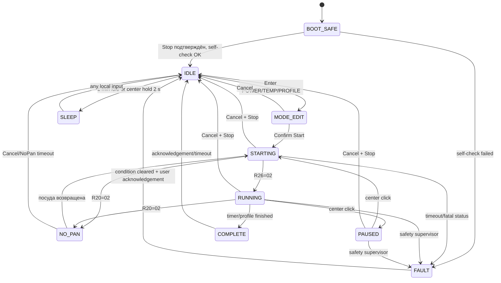

# MCL02M — план рабочей пользовательской прошивки

Дата: 2026-08-23
Статус: утверждённая функциональная спецификация + offline implementation
snapshot `0.1.0-dev`; нагрев этой документацией не запускается.

Редакция 3 от 2026-08-23 учитывает решения владельца по дополнительным значениям
на OLED, новому timer с секундами, двухступенчатому Stop/Sleep, `DISPLAY_OFF`,
NoPan 120 s, LED/buzzer patterns, ограничениям PREHEAT/HOLD, минимальным flash
writes, обоим вариантам отложенного старта, `TIMER SCREEN`, critical alarm и
`HOLD SATURATED`. Реализованный статус вынесен в
[production/IMPLEMENTATION_STATUS.md](production/IMPLEMENTATION_STATUS.md).

## 1. Цель

Сделать для интерфейсной ESP32 плиты Xiaomi/Mijia MCL02M
(`chunmi.ihcooker.v2`) полностью самостоятельную прошивку:

- русский и английский локальный интерфейс;
- два основных режима: ручная мощность и поддержание температуры;
- необязательные пользовательские профили;
- штатные таймер, Pause/Resume, Cancel, Sleep и отображение ошибок;
- локальная web-панель без Mi Home, MIoT, облака и учётной записи Xiaomi;
- сохранение настроек на ESP32;
- управление силовой платой только по уже проверенному I²C-контракту;
- безопасность и управление нагревом не зависят от Wi-Fi или web-панели.

NFC, штатные рецепты, голосовое управление Xiaomi, Mi Home/MIoT и облачные
уведомления в новую прошивку не переносятся.

## 2. На чём основан план

### 2.1. Подтверждено на нашей плите

- Полный исходный 16-MiB dump считан дважды и пригоден для восстановления.
- Проверены OLED 64×48, энкодер с центральной кнопкой, две сенсорные кнопки,
  девять белых LED мощности, LED таймера, сине-оранжевый нижний LED и buzzer.
- Проверен I²C силовой платы: 10 kHz, адрес `0x2A`, heartbeat 500 ms, управляющие
  регистры `0x0D/0x00/0x0C`, обратные регистры `0x20…0x27`.
- Диапазоны gear `1…35 / 36…55 / 56…99` выбирают силовые топологии
  `A1/C1/E1`. Отдельного безопасно подтверждённого интерфейса «выбрать кольцо»
  нет.
- Отключение IGBT, задержки и последовательность реле реализованы силовой
  платой. Интерфейсная ESP передаёт желаемую мощность и следит за подтверждением.
- `R26=02` подтверждает фактический нагрев; `R20=02` означает NoPan;
  `R20=2B` — штатный переход реле, допустимый до 10 s.
- Силовой heartbeat-watchdog с таймаутом до 5 s не обнаружен: при пропаже
  команд нагрев продолжался. Поэтому ESP32 обязана иметь собственный жёсткий
  safety supervisor и watchdog.
- В тестовой прошивке успешно пройдены Start/Stop, Pause/Resume, переходы
  35/36/55/56, NoPan/возврат посуды, таймер и полный Stop.

Подробности: [I²C protocol](../reverse_engineering/reports/MCL02M_I2C_PROTOCOL.md),
[UI hardware map](../reverse_engineering/reports/MCL02M_UI_HARDWARE_MAP.md),
[local control analysis](../reverse_engineering/reports/MCL02M_local_control_analysis.md).

### 2.2. Подтверждено штатной прошивкой и документацией

Официальная инструкция именно Mijia Induction Cooker 2 задаёт локальное меню и
назначение органов управления. MIoT-схема совпадает с именами и типами объектов,
найденных в нашем dump. Это позволяет отделить реальные функции MCL02M от
описаний похожей первой версии плиты.

Источники:

- [официальная инструкция Xiaomi «米家电磁炉2使用手册»](https://cdn.cnbj1.fds.api.mi-img.com/ics-resources/articles/60c9c192ad904a4ba1144ef9.html);
- [MIoT-схема `chunmi.ihcooker.v2`](https://home.miot-spec.com/spec/chunmi.ihcooker.v2)
  (стороннее отображение схемы; факты сверены с локальным dump);
- [локальный статический отчёт](../reverse_engineering/reports/MCL02M_static_reverse_engineering.md).

## 3. Полное штатное локальное меню MCL02M

После подключения питания штатная прошивка показывает анимацию и надпись
«долгое нажатие для включения». Нажатие центрального энкодера на 0,5 s выводит
плиту в Standby. Первый пункт — Manual. В Standby вращение энкодера перебирает
пункты, а короткое нажатие подтверждает выбор и запускает выбранную функцию.

| № | Китайское название | Смысл | Что делает штатная прошивка |
|---:|---|---|---|
| 1 | 手动 | Manual / ручной режим | прямое управление gear `0…99` |
| 2 | 火锅 | Hotpot / хот-пот | штатная автоматическая программа |
| 3 | 蒸煮 | Steam / приготовление на пару | штатная автоматическая программа |
| 4 | 汤粥 | Soup/Porridge / суп-каша | штатная автоматическая программа |
| 5 | 炒菜 | Stir-fry / обжаривание | штатная автоматическая программа |
| 6 | 煎炸 | Fry / жарка | штатная автоматическая программа |
| 7 | Wi-Fi设置 | Wi-Fi setup | сброс и повторная привязка к Mi Home |

Штатное поведение органов управления:

- медленное вращение во время нагрева меняет мощность на 1, быстрое — на 10;
- короткое нажатие центральной кнопки во время нагрева делает Pause/Resume;
- удержание центральной кнопки 3 s из любого состояния переводит плиту в Sleep;
- левая кнопка открывает таймер; шаги 1/10 min, максимум 4 h;
- по окончании таймера нагрев прекращается и плита возвращается в Standby;
- штатно возможен и автономный таймер-будильник без нагрева;
- короткое нажатие Cancel отменяет все текущие операции;
- через 5 min бездействия в Standby экран и подсветки гаснут; любая кнопка
  пробуждает плиту.

Через Mi Home штатно доступны те же шесть режимов, создание своих режимов с
мощностью/температурой/временем, низкотемпературные и многоступенчатые программы,
«двойная циркуляция», «внешнее кольцо», рецепты, push-уведомления и self-check.
Это не дополнительные низкоуровневые команды кольцами: по нашим измерениям
силовая топология всё равно выбирается через диапазон переданного gear.

## 4. Что находится внутри штатной прошивки

Штатная ESP32-прошивка заметно сложнее семи видимых локальных пунктов:

- полноценный UI state machine, обработка энкодера, кнопок, таймера, Pause,
  завершения и ошибок;
- движок одно- и многоступенчатых программ по мощности и температуре;
- типы `OfficialFunctions`, `SingleFire`, `MultiFire`, `SingleTemperature`,
  `Recipe`, `SingleRecipes`;
- 184 записи cooking data;
- фазы приготовления, время фазы, общее время, целевая и текущая температура,
  добавление ингредиентов и переход к следующей фазе;
- до восьми видимых пользовательских рецептов/режимов и порядок меню;
- self-check напряжения, нижнего NTC, IGBT NTC и связи;
- отдельные графические/шрифтовые разделы `icon1` и `wordcode1…3`.

То есть штатная архитектура рассчитана в первую очередь на большой облачный
каталог рецептов. Нам этот слой не нужен; полезны аппаратные драйверы, локальный
state machine, ошибки, таймер и принцип температурного режима.

## 5. Сравнение штатной и нашей прошивки

| Функция | Штатная MCL02M | Наша прошивка |
|---|---|---|
| Основной режим | Manual `0…99` | **Мощность `0…99`**, первый экран после пробуждения |
| Температура | в основном custom/App и автопрограммы | **отдельный основной локальный режим** |
| Автопрограммы | Hotpot, Steam, Soup, Stir-fry, Fry | не переносим как жёстко заданные программы |
| Профили | рецепты и custom modes через Mi Home | 5 локальных профилей × 5 последовательных timed cells; Load без Start |
| Таймер | до 4 h, только `HH:MM` | таймер приготовления до 5 h с секундами; последнее значение живёт в RAM |
| Отложенный старт | есть в штатной модели данных/App | `START IN` и `START AT`, RAM only, NTP для absolute |
| Pause/Resume | центральная кнопка | сохраняем |
| Cancel | отменяет все операции | немедленный Stop нагрева; без перехода в Sleep |
| Sleep | удержание центра 3 s | удержание центра 2 s; сначала подтверждённый Stop |
| Auto sleep | 5 min, настраивается 1…60 min | default 1 min в Idle; отдельно OLED-off через 1 min работы |
| Показания | self-check в Mi Home | локальный экран: сеть, нижний NTC, IGBT; графики в web |
| Ошибки | коды E02…E12 | те же коды + русское/английское объяснение |
| Wi-Fi | Mi Home, Xiaomi account/cloud | локальная AP-настройка и локальная web-панель |
| Удалённый нагрев | Mi Home | только после локального физического разрешения |
| NFC | ссылка на Mi Home-рецепты | не используется |
| Рецепты | большой штатный каталог | не используется |
| Картинки | отдельные icon/wordcode assets | свои иконки, шрифты и короткие анимации |

## 6. Предлагаемая карта локального меню

В текущем offline prototype Standby содержит девять пунктов:

1. **МОЩНОСТЬ / POWER** — всегда первый пункт после пробуждения.
2. **ТЕМПЕРАТУРА / TEMPERATURE**.
3. **ПОКАЗАНИЯ / READINGS**.
4. **ТАЙМЕР / TIMER**.
5. **СТАРТ ЧЕРЕЗ / START IN**.
6. **СТАРТ В / START AT**.
7. **ПРОФИЛИ / PROFILES** — пять слотов; загрузка только setpoints, без Start.
8. **WEB ДОСТУП / WEB ARM** — одноразовое физическое окно 30 s.
9. **НАСТРОЙКИ / SETTINGS**.

Wi-Fi не нужен отдельным повседневным пунктом: он находится внутри Settings.
Это сокращает основное меню и не мешает готовить при отсутствии сети.

### 6.1. Общая логика входа

1. После пробуждения виден пункт POWER, нагрев выключен.
2. Вращение выбирает пункт верхнего меню.
3. Короткое нажатие центра входит в пункт.
4. В режиме POWER/TEMPERATURE вращение задаёт значение.
5. Следующее короткое нажатие центра запускает нагрев.

Это на одно подтверждение длиннее штатного Manual, зато случайное нажатие не
запускает сохранённую ранее высокую мощность.

## 7. Назначение органов управления

### Центральный энкодер

- вращение в Standby — выбор пункта меню;
- вращение в редакторе — изменение значения;
- вращение во время POWER — изменение желаемого gear;
- вращение во время TEMPERATURE — изменение target temperature;
- короткое нажатие — Enter/Confirm/Start;
- короткое нажатие во время нагрева — Pause/Resume;
- удержание 2 s во время работы — Stop и возврат в Idle;
- следующее удержание 2 s из главного Idle — полный Sleep;
- удержание 2 s в неактивном меню/редакторе — Back на один уровень;
- поворот сам по себе никогда не запускает нагрев.

Если OLED погас во время приготовления, первое короткое нажатие центра только
будит экран и не вызывает Pause. Удержание не теряет защитный смысл: если кнопку
не отпустить и держать 2 s, Stop всё равно выполняется.

### Левая сенсорная кнопка TIMER

- обычный cooking timer хранит `HH:MM:SS`, максимум 5 h;
- при входе в editor timer LED загорается сразу и остаётся включённым после
  подтверждения обычного countdown;
- редактор имеет два шага: сначала мигает поле `MM:SS`, затем поле `HH`;
- вращение в `MM:SS` использует ускорение: медленно секунды, быстрее — крупные
  шаги секунд/минут; точная таблица ускорения настраивается после UI-теста;
- первое короткое нажатие центра переключает `MM:SS → HH`;
- второе короткое нажатие центра подтверждает длительность и включает таймер;
- повторное короткое нажатие TIMER при включённом таймере отключает его, но не
  забывает выбранную длительность;
- последнее выбранное значение хранится только в RAM, переживает Sleep, но не
  обязано переживать полное отключение питания;
- LED таймера горит постоянно при обычном cooking countdown;
- при отложенном старте LED таймера мигает.

Для быстрого возврата последнего таймера утверждена отдельная логика: короткий
TIMER при выключенном таймере сразу включает последнее
значение, а удержание TIMER около 1 s открывает редактор. При первом использовании,
когда последнего значения ещё нет, короткий TIMER сразу открывает редактор. Это
быстрее, чем каждый раз проходить оба поля, и не требует ненадёжного double-click.

### Правая сенсорная кнопка CANCEL

- во время нагрева, Pause, Starting, NoPan или Complete — немедленно передать
  Stop и перейти в безопасный Idle, **не** в Sleep;
- в меню/редакторе без нагрева — Back с отменой несохранённого изменения;
- на главном экране Standby — ничего не запускает и ничего не меняет.

Так сохраняется штатный смысл Cancel и предложенное владельцем правило
«выключить всё сразу, но не усыплять плиту».

## 8. Автомат состояний



`SLEEP` означает только выключенный пользовательский интерфейс. ESP32 продолжает
передавать силовой плате нулевую команду, читать температуры и обслуживать
watchdog. Sleep не должен ослеплять safety supervisor.

Нужно различать два состояния:

- `DISPLAY_OFF` — во время активного приготовления через default 60 s гаснет
  только OLED; нагрев и белые LED продолжают работать;
- `SLEEP` — полный пользовательский сон из Idle по удержанию центра или по
  idle-timeout из Settings. Нагрев перед Sleep всегда уже остановлен.

## 9. Режим POWER

- Диапазон: `0…99`.
- На входе нагрев выключен; пользователь задаёт gear и отдельно нажимает Start.
- Медленное вращение: шаг 1; быстрое: шаг 5.
- События энкодера объединяются: даже если пользователь быстро крутит ручку,
  силовая команда меняется не чаще одного раза за heartbeat, то есть 2 раза/s.
- Передаётся последнее желаемое значение; промежуточная очередь из десятков
  gear не воспроизводится.
- Прямой переход через 35/36 и 55/56 разрешён: силовая плата сама безопасно
  отключает IGBT и переключает реле.
- До Start нужное количество белых LED показывает выбранный gear и мигает с
  периодом около 1 s: значение выбрано, но нагрев ещё не начался.
- После Start белые LED горят постоянно и показывают фактически переданный gear,
  а не промежуточное положение ручки.
- При `R26=00` экран показывает STARTING; после `R26=02` — HEATING.

Для V1 предлагается общий жёсткий предел непрерывного цикла 4 h, даже если
пользователь не включил видимый таймер. Расширять его следует только после
долгого теплового теста.

## 10. Режим TEMPERATURE

Исполнительный орган остаётся тем же: силовой плате передаётся gear `0…99`.
Контур ESP32 использует штатный нижний внешний NTC как process value, а IGBT NTC
— только для защиты и теплового мониторинга.

Официальная инструкция заявляет, что внешний подпружиненный датчик в некоторых
режимах может оценивать температуру внутри посуды с точностью до ±3 °C. Однако
реальная ошибка зависит от материала/толщины дна, содержимого и тепловой
инерции. Поэтому на экране и в документации нельзя обещать точность температуры
еды до отдельной калибровки с термопарой.

### 10.1. Алгоритм V1

Не начинать сразу с агрессивного PID. Первый безопасный вариант:

1. **PREHEAT** — ограниченный максимальный gear до подхода к setpoint.
2. **APPROACH** — раннее снижение мощности с учётом скорости роста температуры.
3. **HOLD** — PI/гистерезис с anti-windup и фильтрацией NTC.
4. **OVERSHOOT** — gear 0 до возвращения в допустимую полосу.

Обязательные свойства:

- обновление регулятора синхронно с новым NTC sample, максимум 2 раза/s;
- ограничение максимального gear задаётся пользователем в web-профиле, но не
  может превысить глобальный safety limit;
- отдельный rate limiter выхода и защита от дребезга около 35/36 и 55/56;
- в автоматическом режиме переход в соседнюю релейную топологию только после
  устойчивой потребности, чтобы PID не щёлкал реле туда-сюда;
- на Pause и NoPan интегратор замораживается/сбрасывается;
- после возврата посуды — мягкий повторный вход через APPROACH, не полный boost;
- IGBT temperature никогда не является cooking setpoint.

Предварительное ограничение владельца для первого эксперимента:

- PREHEAT работает только в верхней топологии: gear не ниже 56; конкретное
  значение `56…99` выбирается по target temperature и скорости нагрева;
- APPROACH заранее выключает/снижает boost по прогнозируемому выбегу;
- после первоначального разогрева PREHEAT повторно не включается из-за небольшого
  отклонения температуры;
- HOLD жёстко ограничен диапазоном `0…35`, чтобы не пересекать релейную границу;
- если gear 35 долго не способен удержать высокую температуру, controller
  фиксирует `HOLD SATURATED`, показывает предупреждение и включает orange LED,
  но сам не переходит выше 35.

Минимум 56 на PREHEAT может заметно перерегулировать низкие setpoints 40…70 °C,
поэтому переход в APPROACH должен учитывать не только текущую температуру, но и
её производную/прогноз выбега. Это один из главных объектов калибровочного теста.

### 10.2. Что требуется измерить перед production

- холодное смещение обоих NTC;
- NTC против термопары в воде примерно при 40/60/80/95 °C;
- разгон и выбег на маленькой и большой посуде;
- минимальный устойчивый gear в каждом диапазоне;
- перерегулирование после смены `A1/C1/E1`;
- тепловой прогон не менее 2 h.

До этой калибровки TEMPERATURE должен иметь метку `BETA` и консервативный
диапазон. Официальная инструкция MCL02M не публикует числовой максимум setpoint:
она указывает только rated power 2100 W, наличие temperature control и E05 при
перегреве нижнего датчика. Для предыдущей Xiaomi-платформы и custom mode Mi Home
устойчиво документируется диапазон 40…190 °C. Поэтому предварительный диапазон
нашей firmware меняется с 40…200 на **40…190 °C**, но помечается как provisional
до проверки реального MCL02M-плагина и калибровки.

E05 — это не «достигнута максимальная заданная температура», а отдельная
аварийная защита bottom sensor high temperature. Числовой порог E05 ни
официальная инструкция, ни интерфейсный dump не раскрывают; он находится внутри
силового контроллера. Его нельзя подменять верхней границей пользовательского
температурного режима.

## 11. Профили

Профили не нужны для первой рабочей версии, но архитектуру лучше заложить сразу.
Предлагается пять слотов, на плите доступен только выбор и запуск; редактирование
удобнее выполнять через web.

Каждый из пяти профилей содержит имя и до пяти последовательных ячеек. В каждой
ячейке задаются POWER/gear либо TEMPERATURE/target и обязательная длительность.
Нулевая длительность пропускает ячейку; общий профиль ограничен 5 h. Между
активными ячейками звучит двойной сигнал. Pause/NoPan замораживают текущую
ячейку. Web только редактирует профиль, физический Load не запускает нагрев —
нужно отдельное нажатие Start. Подсказки «добавьте ингредиент» и большой каталог
рецептов не нужны.

## 12. Таймер и завершение

- Видимый cooking timer: `00:00:00…05:00:00`.
- Редактирование: мигающий `MM:SS`, затем мигающий `HH`, затем Confirm.
- В `MM:SS` используется encoder acceleration; часы меняются по одному.
- Последняя полностью подтверждённая длительность сохраняется в RAM и снова
  предлагается при следующем входе.
- Timer в NVS/flash не записывается.
- Отсчёт начинается после подтверждения фактического нагрева `R26=02`.
- В V1 таймер считает активное приготовление и замораживается на Pause/NoPan.
- По нулю: Stop, проверка `R26=00`, экран COMPLETE, мелодия завершения, затем Idle.
- Cancel немедленно прекращает цикл без COMPLETE-мелодии.
- Автономный кухонный будильник без нагрева можно добавить позже; для основной
  задачи он только усложняет состояния.

### 12.1. Постоянный экран оставшегося времени

В Settings добавляется `TIMER SCREEN: AUTO/ALWAYS`:

- `AUTO` — OLED гаснет по обычному active-display timeout;
- `ALWAYS` — при активном timer OLED не гаснет и показывает только оставшееся
  время крупными цифрами;
- раз в минуту блок времени перемещается между тремя вертикальными позициями:
  верх, середина, низ;
- на этом минимальном timer-screen угловые дополнительные параметры скрыты.

### 12.2. Отложенный старт

Это отдельный timer, не смешанный с длительностью приготовления:

- `START IN` — обратный отсчёт до запуска, не требует точного времени;
- `START AT` — запуск в `HH:MM`, доступен только при валидном сетевом времени;
- ESP32 синхронизирует clock через NTP после подключения к роутеру и периодически
  обновляет его; timezone хранится в Settings;
- timer LED всё время мигает, пока ожидается отложенный старт;
- расписание хранится только в RAM: после power loss автоматический нагрев не
  восстанавливается;
- установка требует физического подтверждения у плиты;
- перед фактическим Start выполняется полный self-check; при NoPan действует
  общий 120-s timeout, затем запуск отменяется;
- при невалидном времени, fault или watchdog reset отложенный Start отменяется.

## 13. Экран READINGS и диагностика

Обычному пользователю действительно нужны три текущих значения:

1. `LINE` — напряжение сети из self-check;
2. `POT/NTC` — температура нижнего внешнего датчика;
3. `IGBT` — температура силового транзистора/радиатора.

В web-панели дополнительно показываются:

- желаемый и фактически отправленный gear;
- текущая топология `A1/C1/E1`;
- `R20`, `R26`, текущая ошибка;
- состояние Start/Stop/Pause/NoPan;
- версия интерфейсной и силовой прошивки;
- Wi-Fi RSSI, IP, uptime и счётчики I²C-ошибок;
- короткий RAM-график последних температур/gear.

Расширенные регистры нужны сервису, но не должны загромождать OLED.

## 14. Settings

Предлагаемое локальное меню:

1. `LANGUAGE` — English / Русский / 简体中文; китайская локализация использует
   компактный статический набор OLED-глифов без бегущих строк.
2. `WI-FI` — состояние, настройка, показ IP, сброс сети.
3. `WEB ACCESS` — создать/сменить пароль, временно разрешить remote control.
4. `SOUND` — menu clicks On/Off; аварийный звук не отключается.
5. `DISPLAY`:
   - яркость;
   - `ACTIVE OLED TIMEOUT`, default 60 s;
   - `TIMER SCREEN: AUTO/ALWAYS`;
   - `CONTEXT VALUE`: On/Off — в POWER справа внизу bottom NTC, в TEMPERATURE
     справа внизу фактический gear;
   - `IGBT VALUE`: On/Off — IGBT temperature слева внизу.
6. `SLEEP` — время бездействия в остановленном Idle до полного Sleep,
   `1…60 min`, default 1 min. Это не таймер гашения OLED во время готовки.
7. `CLOCK` — timezone, NTP status и локальное время; нужен для delayed Start.
8. `INFO` — версии, IP, идентификатор устройства.
9. `FACTORY RESET` — очищает только наши настройки после длинного подтверждения.

Safety thresholds, I²C-регистры и калибровка NTC не являются обычными
пользовательскими настройками. Их можно открыть только в сервисном web-разделе.

## 15. Ошибки и реакция

| Код | Штатный смысл | Предлагаемая реакция |
|---|---|---|
| E02 | нет посуды | NoPan, orange blink, до 120 s на возврат, затем Stop |
| E03 | высокое напряжение | Stop, показать LINE HIGH, повторный Start только пользователем |
| E04 | низкое напряжение | Stop, показать LINE LOW, повторный Start только пользователем |
| E05 | перегрев нижнего датчика | latched Stop до охлаждения и подтверждения |
| E07 | перегрев IGBT | latched Stop до охлаждения и подтверждения |
| E08 | неисправен IGBT NTC | latched Stop, сервис |
| E10 | неисправен нижний NTC | latched Stop, сервис |
| E11 | нет связи интерфейс/силовая плата | немедленный Stop, watchdog/reboot, сервис при повторе |
| E12 | обрыв катушки/силовой цепи | latched Stop, сервис |

Кроме штатных кодов нужны собственные controller faults, лучше с другим
префиксом (`C01…`), чтобы не выдавать их за ошибки силовой платы:

- `C01` — Start не подтверждён за 8 s;
- `C02` — Stop не подтверждён;
- `C03` — завис/пропуск safety heartbeat;
- `C04` — повреждены настройки, загружены безопасные defaults;
- `C05` — внутренний watchdog/reset во время активного цикла.

В отличие от штатной автоматической автовосстановительной логики, после
напряжения или перегрева нагрев сам не возобновляется: требуется действие
пользователя. Это исключает неожиданный повторный старт.

## 16. IGBT, вентилятор и дополнительные пределы

Вентилятором управляет силовая плата; интерфейсная ESP не задаёт его скорость.
Наблюдавшееся выключение вентилятора примерно при 55 °C IGBT — это порог
послеохлаждения, а не температура, которую интерфейс должен «поддерживать» во
время готовки.

Новая firmware должна:

- непрерывно показывать/логировать IGBT temperature;
- доверять штатным токовым/температурным защитам силовой платы;
- иметь дополнительный более консервативный software Stop;
- не отключать питание и не мешать автономному fan cooldown после Stop/Sleep.

Испытательные пределы 80 °C IGBT и 120 °C bottom NTC уже работали как
консервативные аварийные границы, но это не доказанные штатные пороги. Перед
production их надо утвердить отдельным тепловым тестом; пользователю они не
должны быть доступны из обычного меню.

## 17. Светодиоды, OLED и звук

### LED

- перед Start нужное количество белых LED мигает с периодом около 1 s;
- во время нагрева белые LED горят постоянно и показывают применённую мощность;
- timer LED горит постоянно при cooking countdown;
- timer LED мигает при delayed Start;
- нижний blue — Wi-Fi connected/ready;
- blue slow blink — provisioning или сеть потеряна;
- orange blink — NoPan; orange fast/repeated blink — fault;
- при fault оранжевый статус имеет приоритет над Wi-Fi-индикацией.

### Buzzer

- короткий menu click, Start/Pause/Cancel, startup, Sleep и Complete melodies —
  один общий класс неаварийных звуков, отключаемый в Settings;
- завершение приготовления — отдельная короткая мелодия;
- критическая ошибка — три громких паттерна около 4 kHz длительностью примерно
  по 5 s, интервалы между паттернами 4 s; этот alarm никогда не отключается;
- после трёх alarm bursts звук прекращается, fault остаётся на OLED;
- при критическом fault автоматический Sleep запрещён до подтверждения
  пользователя;
- NoPan — редкий напоминательный сигнал, а не непрерывный писк.

### OLED

Матрица всего 64×48, поэтому на рабочем экране нужны одна крупная величина,
короткий статус и 2–3 маленьких индикатора. Длинные русские предложения лучше
показывать в web, а на OLED использовать понятные пиктограммы и короткие слова.

Во время приготовления:

- OLED гаснет через `ACTIVE OLED TIMEOUT`, default 3 min; белые LED остаются;
- первое короткое нажатие центра или первый поворот энкодера только будит OLED;
- wake-событие не меняет режим, power или temperature;
- все encoder detents в течение следующих 1,5 s игнорируются, затем новое
  вращение снова разрешает изменение setpoint;
- Cancel никогда не поглощается экранным wake-lock и всегда немедленно даёт Stop;
- при `TIMER SCREEN=ALWAYS` вместо гашения остаётся только перемещаемый countdown.

Контекстные углы рабочего экрана настраиваются независимо:

- POWER: справа внизу bottom NTC;
- TEMPERATURE: справа внизу текущий применённый gear;
- оба режима: слева внизу IGBT temperature;
- любой из двух дополнительных блоков можно отключить.

Один полный 1-bit framebuffer занимает только 384 bytes. Реализованы десять
статических полноэкранных кадров: turn-on, wake, cooking, confirm, cancel, ready,
no-pan, error и две стадии Sleep. Persistent fault/NoPan/Complete всегда
приоритетнее временной картинки; bitmap rendering не блокирует силовой heartbeat.
В шаблоне error пример `E03` очищается при генерации, а поверх рисуется
фактический live E-код.

## 18. Архитектура безопасности и I²C

Слои должны быть строго разделены:

1. **Power-board driver** — единственный владелец I²C.
2. **Safety supervisor** — единственный слой, который может разрешить ненулевой
   gear; любой fault принудительно заменяет его на Stop.
3. **Cooking controller** — POWER/TEMPERATURE/PROFILE и timer.
4. **UI state machine** — преобразует физические действия в intents.
5. **Web API** — также создаёт intents, но никогда не пишет I²C напрямую.
6. **Storage** — versioned configuration, не участвует в heartbeat.

Ключевые правила:

- при любом boot/reset первым состоянием является Stop;
- ненулевая команда возможна только после self-check связи, напряжения и NTC;
- heartbeat строго каждые 500 ms, независимо от OLED/Wi-Fi/NVS;
- UI/web могут менять желаемое значение сколько угодно часто, но driver
  объединяет изменения и передаёт только последнее не чаще heartbeat;
- `STARTING` продолжается до `R26=02`, timeout 8 s;
- `R20=2B` разрешён максимум 10 s;
- две последовательные плохие I²C-цикла — Stop/fault;
- аппаратный ESP task watchdog и interrupt watchdog включены;
- операции Wi-Fi, DNS, flash/NVS и отрисовка никогда не блокируют safety task;
- после watchdog reset firmware не пытается восстановить предыдущий нагрев.

Из-за отсутствия подтверждённого watchdog на силовой плате это самая важная
часть проекта: web UI и красивые картинки вторичны.

## 19. Можно ли сохранять настройки на ESP32

Да. Для этого подходит NVS: настройки переживают выключение питания, записи
изноcоустойчиво распределяются по flash, а данные можно версионировать.

Реализованная схема prototype:

- уникальный namespace `mcl02m_v1`, не пересекающийся со штатными Xiaomi keys;
- `config_version`, язык, звук, яркость, display/sleep timeouts, дополнительные
  параметры экрана, timer-screen mode, timezone и web password hash;
- Wi-Fi ON/OFF и SSID/password;
- пять profile records по пять timed cells;
- запись только после явного Confirm изменения persistent Settings;
- не писать telemetry, температуру или положение энкодера каждые 500 ms;
- не писать cooking timer, delayed Start, текущий режим, gear или ход готовки;
- последнее значение timer и расписание живут только в RAM;
- при повреждённом config — безопасные defaults и `C04`, без нагрева;
- никогда не вызывать общий `nvs_flash_erase()`; явный физический Factory reset
  делает `nvs_erase_all()` только внутри custom namespace.

В текущей заводской partition table NVS имеет 16 KiB, чего для этих данных
достаточно. Во время разработки можно использовать отдельный namespace в этом
разделе, предварительно проверив свободные entries. Это изменит только NVS, а
исходный полный dump всё равно позволяет вернуть абсолютно заводское состояние.

Важно: Secure Boot и Flash Encryption выключены. Пароль web можно хранить только
как hash, но пароль домашней Wi-Fi-сети ESP обязана уметь получить обратно, а
значит при физическом чтении flash его можно извлечь. NVS encryption без
защищённого ключа/eFuse не даёт настоящей защиты от физического доступа. eFuse
ради этого без отдельного решения не меняем.

## 20. Wi-Fi onboarding и web-панель

### 20.1. Первое подключение в prototype

1. Wi-Fi по умолчанию выключен; пользователь физически включает его в
   `Setup → Wi-Fi → Power`.
2. Плита поднимает WPA2 AP `MCL02M-SETUP-XXXX`; адрес — `192.168.4.1`, а
   setup password можно посмотреть в физическом Wi-Fi submenu.
3. В self-contained web-странице пользователь вручную вводит SSID/password и
   задаёт локальный admin password минимум из восьми символов.
4. После STA connect web показывает полученный LAN IP; setup AP остаётся
   доступным как recovery path.
5. Если подключиться не удалось, локальное управление плитой продолжает
   работать и AP остаётся доступным.

Wi-Fi toggle сохраняется. После reboot значение ON повторно запускает радио и
автоматически подключает сохранённую сеть. Физический Factory reset забывает
admin password, сеть, Settings и Profiles, после чего Wi-Fi снова OFF.

Автоскан сетей, captive DNS и `mcl02m.local` не включены в offline prototype:
это удобства следующей итерации, не влияющие на safety/control.

### 20.2. Авторизация и управление нагревом

Реализовано в offline prototype:

- чтение статуса и изменение настроек требуют local admin login;
- сессия хранится в `HttpOnly`, `SameSite=Strict` cookie и имеет timeout;
- brute-force ограничивается;
- Wi-Fi пароль, admin password и session token никогда не печатаются в лог;
- web API не содержит Start/Stop/Pause/setpoint/timer/delayed Start; всё
  управление нагревом выполняется только физическими органами плиты;
- Wi-Fi loss сам по себе не останавливает уже подтверждённое приготовление:
  цикл остаётся под локальным safety supervisor;
- локальные Cancel/Fault всегда имеют приоритет над сетью.

Простой HTTP в доверенной домашней сети удобнее, но не шифрует трафик от другого
участника LAN. HTTPS с self-signed certificate защищает трафик, но создаёт
неудобное предупреждение браузера. Для V1 допустим local HTTP + сильный пароль +
обязательное физическое разрешение нагрева; HTTPS можно добавить после
стабилизации основной логики. Публиковать порт в интернет нельзя.

### 20.3. Страницы web UI

- **Dashboard** — read-only состояние, gear, target/current temperature, timer.
- **Live status** — NTC, IGBT, gear, voltage и raw I²C counters; browser получает
  snapshot раз в секунду.
- **Profiles** — пять профилей по пять timed cells, edit/load без Start.
- **Settings** — язык, display, sound, sleep, Wi-Fi, access.
- **Diagnostics** — self-check, версии, I²C counters, raw registers read-only.
- **Update** отсутствует; добавлять его можно только позднее с hash/signature и
  rollback.

## 21. Flash, картинки и обновление прошивки

ESP32 имеет 16 MiB flash. Точный размер и SHA текущего offline prototype
фиксируются в [production/BUILD_MANIFEST.md](production/BUILD_MANIFEST.md). Один
штатный OTA slot — `0x160000` (1441792 bytes); образ помещается с большим запасом.

Кроме того, штатная таблица содержит:

- `icon1` — 1 MiB;
- `wordcode1` — 5 MiB;
- `wordcode2` и `wordcode3` — по 3 MiB, сейчас практически пустые.

На этапе разработки:

- сохраняем штатный `ota_0` как быстрый заводской rollback;
- пишем custom app только в `ota_1`;
- маленькие assets компилируем внутрь app;
- partition table и asset partitions не меняем без отдельного подтверждения;
- обновляем custom slot по UART, когда плита загружена не из него.

После стабилизации, отдельным необратимым этапом можно спроектировать новую
partition table с factory recovery, двумя custom OTA slots и отдельным assets
разделом. До этого штатный полный dump остаётся главным способом полного
восстановления.

## 22. Предлагаемая структура firmware

```text
firmware/production/
  main/
    app_main.c
    power_board.c/.h       # I2C owner, heartbeat, decode R20…R27
    safety_supervisor.c/.h # fail-safe gate, watchdog, fault latch
    cooking_engine.c/.h    # POWER/TEMP/PROFILE/timer
    temperature_ctrl.c/.h  # preheat/approach/hold
    input.c/.h             # encoder, center, touch buttons
    ui_state.c/.h          # UI intents and state machine
    display.c/.h           # OLED framebuffer, fonts, icons
    indicators.c/.h        # 9 LEDs, timer LED, blue/orange LED
    buzzer.c/.h
    settings.c/.h          # versioned NVS namespace
    network.c/.h           # STA/AP/provisioning/mDNS
    web_server.c/.h        # REST/WebSocket, auth, no direct I2C
    telemetry.c/.h         # RAM ring buffer
  assets/
  tests/
    host_state_machine/
    i2c_replay/
```

Плата фактически работает в Unicore из-за `DISABLE_APP_CPU=1`, поэтому все задачи
надо проектировать для одного ядра. Приоритеты: safety/I²C → control → local UI →
network/web → background telemetry.

## 23. Этапы реализации

### Этап 1 — production skeleton, локальный POWER и новый UI

- перенести проверенные drivers из `power_test`, удалить test-only remote API;
- production safety supervisor и watchdog;
- POWER, Start/Stop, Pause/Resume, двухступенчатый Stop/Sleep и Cancel;
- timer с секундами до 5 h, RAM-last-value, COMPLETE;
- OLED-off/wake guard, дополнительные угловые параметры, LED/buzzer patterns;
- NoPan 120 s и полный error screen;
- READINGS;
- RU/EN базовый font и простой OLED UI;
- NVS только для подтверждённых Settings; timer/telemetry не пишутся;
- supervised power tests.

### Этап 2 — clock и отложенный старт

- минимальный Wi-Fi provisioning, чтобы получить сетевое время;
- SNTP/NTP, timezone и индикация валидности clock;
- отдельные `START IN` и/или `START AT`;
- мигающий timer LED, физическое подтверждение и отмена после power loss/fault;
- тесты NoPan на момент запланированного запуска.

### Этап 3 — температурный режим

- NTC/термопара calibration;
- PREHEAT `56…99`, APPROACH и HOLD `0…35`;
- тесты на двух размерах посуды и разных setpoints;
- проверка low-target overshoot и `HOLD SATURATED` на высоких setpoints;
- двухчасовой thermal soak.

### Этап 4 — полноценный Wi-Fi и web read-only

- AP provisioning, STA reconnect, mDNS;
- Dashboard, readings, graph, diagnostics;
- хранение credentials в отдельном NVS namespace;
- cooking не зависит от web task.

### Этап 5 — безопасное web-управление

- login/session/CSRF/rate limit;
- physical remote-arm;
- Stop, Pause/Resume, gear/temperature/timer intents;
- fault injection и network-loss tests.

### Этап 6 — профили и полировка

- пять профилей по пять последовательных timed cells;
- красивые icons/animations и финальные звуки;
- export/import settings;
- документация и recovery procedure;
- решение о production partition table и OTA только после отдельного согласия.

## 24. Решения, предлагаемые зафиксировать сейчас

1. Главный режим — POWER, второй — TEMPERATURE.
2. Пять штатных автопрограмм и рецепты не переносим.
3. Profiles проектируем, но не блокируем ими V1.
4. Cancel всегда останавливает активный нагрев и возвращает в Idle, не в Sleep.
5. Первое удержание центра 2 s во время работы — Stop; следующее из Idle — Sleep.
6. Удержание центра 2 s в неактивном меню — Back.
7. Auto sleep default 1 min; активный OLED-off default 60 s — отдельные таймеры.
8. Cooking timer имеет секунды, максимум 5 h и помнит последнее значение в RAM.
9. Обычный timer LED горит, delayed Start LED мигает.
10. NoPan мигает оранжевым и ждёт возврата посуды до 120 s.
11. POWER encoder: slow 1, fast 5; выбранные до Start белые LED мигают.
12. В TEMPERATURE: PREHEAT `56…99`, HOLD `0…35` для первого эксперимента.
13. Локальные показания — voltage, bottom NTC, IGBT; угловые значения на рабочем
    экране включаются независимо в Settings.
14. Все неаварийные sounds отключаются одной настройкой; критический alarm —
    всегда три приблизительно 5-s bursts с интервалом 4 s, затем только fault OLED
    без auto-sleep до подтверждения.
15. Настройки сохраняются в уникальном versioned NVS namespace; telemetry,
    cooking timer, delayed Start и состояние приготовления во
    flash не пишутся.
16. Отложенный старт реализован в offline prototype: `START IN` и `START AT`,
    NTP для absolute и физическое подтверждение remote-команд.
17. Wi-Fi полностью необязателен для обычной локальной готовки.
18. Remote Start отсутствует; web не управляет нагревом.

## 25. Зафиксированные уточнения и оставшиеся инженерные параметры

- short TIMER включает/выключает последнее значение, hold TIMER открывает
  двухполевый редактор `MM:SS → HH`;
- encoder acceleration для `MM:SS`, стартовый вариант:
  slow 1 s, medium 5 s, fast 30 s, sustained-fast 60 s;
- после OLED wake второе центральное нажатие доступно сразу после обычного
  debounce; 1,5-s guard относится только к encoder; Cancel не блокируется;
- на Pause медленно мигает ранее применённое количество белых LED;
- `SOUND OFF` отключает все неаварийные sounds; критический alarm остаётся;
- delayed Start поддерживает оба варианта `START IN` и `START AT`;
- HOLD выше 35 не поднимается; при saturation показывает предупреждение и orange;
- cooking timer на NoPan замораживается;
- web V1 использует HTTP только в доверенной LAN, login/session/CSRF и physical
  WEB ARM; HTTPS отложен;
- Profiles включены: пять слотов × пять timed cells, `0` пропускает cell,
  двойной сигнал между cells, Load никогда не запускает нагрев;
- отдельный таймер-будильник без нагрева в prototype не включён;
- окончательный диапазон/шаг TEMPERATURE после калибровки; provisional 40…190 °C;
- точные PI/PID coefficients и thermal thresholds остаются предметом supervised
  калибровки;
- десять согласованных статических OLED-картинок включены; многокадровые
  анимации пока не используются;
- новая partition table и полноценный OTA — только после стабильной версии.
